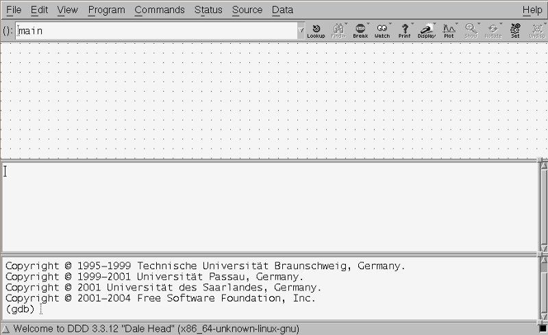

Welcome to CS264 Lab 2
======================

Justin Riley (staff 'at' cs264 'dot' org)

Software Tools for Academics and Researchers

Office of Educational Innovation and Technology

Massachusetts Institute of Technology

Office Hours
------------

**Date/Time**: Fridays 3:00pm - 5:00pm 

**Location**: NE-48-308, 77 Massachusetts Ave, Cambridge, MA 02139

Downloading the Lab Slides
--------------------------
For those that are interested in looking over the slides for the first two labs you can download them `here <http://github.com/jtriley/cs264labs/tree/master/pdfs/cs264labs.pdf>`_

Sign-up for an Amazon Web Services Account
------------------------------------------
If you haven't already done so please sign-up for an Amazon Web Services (AWS) account and provide your AWS user id in the `homework 0 survey <http://www.cs264.org/homeworks/homeworks/hw0.php>`_. Please see homework 0 for detailed instructions on how to sign up for an Amazon Web Services account and also how to sign up for the Elastic Compute Cloud (EC2) web service.

Homework 0 Survey
-----------------
If you haven't already done so please fill out and submit the `homework 0 survey <http://www.cs264.org/homeworks/homeworks/hw0.php>`_.

Resonance GPU Cluster
---------------------
Several people have had issues connecting to the resonance cluster:

.. code-block:: none

    $ gpu-login
    Your job 2432796 ("QLOGIN") has been submitted
    waiting for interactive job to be scheduled ...
    Your interactive job 2432796 has been successfully scheduled.
    Establishing /opt/gridengine/bin/rocks-qlogin.sh session to host cuda-5-0.local ...
    Connection closed by 10.101.43.244
    /opt/gridengine/bin/rocks-qlogin.sh exited with exit code 255

This particular error occurs because you haven't yet been given full access to the resonance CUDA cluster. IRCS has been kind enough to relax the requirements for full access and has also removed the need to enable SSH Agent forwarding. This means anyone that is able to login to resonance.seas.harvard.edu should be able to use gpu-login without issues. If you're still having issues logging in to resonance or using the gpu-login command please send an email to ircshelp@seas.harvard.edu.

Another commonly reported error:

.. code-block:: none

    $ gpu-login
    Your job 2433281 ("QLOGIN") has been submitted
    waiting for interactive job to be scheduled ...timeout (5 s) expired while waiting on socket fd 4

This issue is generally caused by having another already active session running. This can happen if you don't exit out of a previous gpu-login session correctly. To prevent this make sure that you always type "exit" when you're done using a gpu-login session. If this error occurs you need to first cancel the old session:

.. code-block:: none

    $ qstat
    job-ID  prior   name       user         state submit/start at     queue                          slots ja-task-ID 
    -----------------------------------------------------------------------------------------------------------------
    2433880 0.56895 QLOGIN     jtriley      r     02/03/2011 15:40:41 gpu-interactive.q@cuda-1-1.loc     1        

    $ qdel 2433880

After you've cancelled your previous gpu-login session you should now be able to use the gpu-login command without error assuming there are enough available GPU nodes to schedule your gpu-login session.

Using Graphical Applications on the Resonance GPU Cluster
---------------------------------------------------------
In order to use graphical applications such as the CUDA Profiler and the DDD debugger you will need to enable X11 forwarding in your SSH client configuration.

On Linux/Mac this can be accomplished using the -X flag:

.. code-block:: none

    $ ssh -i ~/.ssh/myprivkey -A -X myuser@resonance.seas.harvard.edu

If you wish to set this permanently you can do this using the ~/.ssh/config file. If the 'config' file does not exist in the ~/.ssh directory you will need to create it. Then you can permanently enable the -X option anytime you ssh to resonance by putting the following in ~/.ssh/config:

**NOTE**: On Mac you will need to install the X server that comes with Mac. If you do not already have X installed you can install it from the Mac OSX installer CD. 

.. code-block:: none

    $ vim ~/.ssh/config
    (add the following lines to the file)
    Host resonance*
        HostName resonance.seas.harvard.edu
        IdentityFile /path/to/your/privkey
        ForwardX11 yes
        ForwardAgent yes

On Windows you will need to download and install an X server. `Xming <http://sourceforge.net/projects/xming/files/Xming/6.9.0.31/>`_ is freely available and works well with `Putty <http://www.chiark.greenend.org.uk/~sgtatham/putty/>`_. After you've installed and started the X server you will need to configure Putty to "Enable X11 forwarding". 

`Here's a guide on how to configure Xming and Putty on Windows <http://www.math.umn.edu/systems_guide/putty_xwin32.html>`_ (thanks to Robert Bowden for posting the link on the forums!)

Debugging CUDA using cuda-ddd on Resonance
------------------------------------------
In this Lab we will take a look at how to remotely use the Data Display Debugger (DDD) application to graphically debug our CUDA code. DDD allows you to debug and monitor variables via a graphical console. You will still need to know how to switch between CUDA threads as we did in the first Lab using cuda-gdb, however, printing and monitoring variables should be much easier with DDD. 

The first step is to login to resonance with X11 forwarding enabled and run the 'gpu-login' command:

.. code-block:: none

    $ ssh -i ~/.ssh/myprivkey -X -A username@resonance.seas.harvard.edu
    $ gpu-login

Once you've successfully been logged in to a GPU-enabled machine you will then need to add the cuda-ddd package in order to access the 'cuda-ddd' command:

.. code-block:: none

    $ module load packages/ddd/3.3.12

If you configured your ~/.bashrc or ~/.bash_profile to permanently load packages as disussed in HW0 you should be able to permanently load cuda-ddd using:

.. code-block:: none

    $ module initadd packages/ddd/3.3.12

Once you've added the ddd package you should now be able to run the cuda-ddd command:

.. code-block:: none

    $ cuda-ddd

.. raw:: latex

    \newpage 

Provided you've successfully configured X11 forwarding you should now see a window popping up on your desktop.

This window is the cuda-ddd application running remotely on resonance:

.. raw:: latex

    \newpage 

Now that we've launched ddd let's open the example program from HW0 (**don't forget to compile with -g -G flags!**).

To do this go to File->Open Program:

.. raw:: latex

    \newpage 

This will prompt you with a dialog asking you to select the program you want to run. Select the example CUDA program from HW0 and press the "Open" button:

.. raw:: latex

    \newpage 

Once you've opened the example program you should see:

.. raw:: latex

    \newpage 

The next step is to create a breakpoint. You can do this by typing a 'break' command in the cuda-gdb console in the bottom pane of DDD:

.. image:: _static/ddd_set_breakpoint.png

.. raw:: latex

    \newpage 

You can also set a breakpoint graphically by right clicking the line you're interesetd in (make sure to right-click in the whitespace before the line) and selecting "Set breakpoint":

.. raw:: latex

    \newpage 

In this example we've added a breakpoint at the *mangleGPU* function.

Now that we have a breakpoint set it's time to run your program. To do this go to Program->Run...:

.. raw:: latex

    \newpage 

This will prompt you with a dialog to enter arguments. If your code does not take arguments you may simply press the "Run" button to start your program within the CUDA debugger. The example code in HW0 requires a -string argument so we add it here:

.. raw:: latex

    \newpage 

After you press the "Run" button in the arguments dialog your program will run and the debugger will stop at the first defined breakpoint (mangleGPU in this case). You can now use your mouse to hover over variables and inspect their current values:

.. raw:: latex

    \newpage 

In addition to highlighting we can monitor variables using DDD. This will allow us to select many different variables we're interested in and inspect them all at once each time we step through the code or switch GPU threads. In order to add a monitor for a variable simply highlight the variable you're interested in, right-click, and select *Display <varname>*:

.. raw:: latex

    \newpage 

Notice how a new variable gets added to the top window pane in DDD. This pane is the variable monitoring pane. Each time you right click a variable and select the *Display <varname* item it should show up in the variable monitoring pane.

.. raw:: latex

    \newpage 

Now that we have our monitors set up, let's switch GPU threads and see how the variable monitor pane updates all the values we're interested in.

.. raw:: latex

    \newpage 

This concludes our introduction to using the DDD program to debug CUDA code. For more information on all of DDD's features please have a look at the `DDD user manual <http://www.gnu.org/manual/ddd/html_mono/ddd.html>`_.

Using CUDA Memcheck to Detect Memory-Access Errors
--------------------------------------------------
The CUDA memcheck tool helps to detect errors in your code related to memory-access issues. There are two ways to use the CUDA memcheck utility. You can use the cuda-memcheck command line tool to simply run your code and report the errors it finds:

.. code-block:: none

    cuda-memcheck example -string='hi there class'

    ========= CUDA-MEMCHECK
    Using device 0: Tesla T10 Processor
    Current date/time: (1296164555) Thu Jan 27 16:42:35 2011
    Input string:      hi there class
    CPU result:        sishtiitetst c
    GPU result:        sishtiitetst c
    ========= ERROR SUMMARY: 0 errors

This approach will simply print out any errors it found. In this case since the example.cu code included in Homework 0 does not have any memory errors the number of errors reported is 0. 

Another option is to use the memcheck utility within the CUDA debugger. This has the advantage that when a memory-access error is detected cuda-gdb will immediately drop you to a shell and allow you to inspect the state of the world. This approach is a bit more complicated given that you have to launch and manage the debugger but it can be extremely powerful when fixing those hard to find bugs.

.. code-block:: none

    (cuda-gdb) set cuda memcheck on
    (cuda-gdb) r
    Starting program: memcheck_demo
    [Thread debugging using libthread_db enabled]
    [New process 23653]
    Running unaligned_kernel
    [New Thread 140415864006416 (LWP 23653)]
    [Launch of CUDA Kernel 0 on Device 0]

    Program received signal CUDA_EXCEPTION_1, Lane Illegal Address.
    [Switching to CUDA Kernel 0 (<<<(0,0),(0,0,0)>>>)]
    0x0000000000992e68 in unaligned_kernel <<<(1,1),(1,1,1)>>> () at
    memcheck_demo.cu:5
    5
    *(int*) ((char*)&x + 1) = 42;
    (cuda-gdb) p &x
    $1 = (@global int *) 0x42c00

    (cuda-gdb) c
    Continuing.
    Program terminated with signal CUDA_EXCEPTION_1, Lane Illegal Address.
    The program no longer exists.
    (cuda-gdb)

The above output is from the code included in the `cuda-memcheck user manual <http://people.maths.ox.ac.uk/gilesm/cuda/doc/cuda-memcheck.pdf>`_. This code purposefully makes misaligned and out of bound memory accesses in order to demonstrate the behavior within cuda-gdb.

Profiling CUDA code using the Visual Profiler
---------------------------------------------
We will learn about profiling CUDA code in depth during upcoming lectures. For now we will take a practical look at the CUDA Visual Profiler. Specifically we'll learn how to launch the CUDA Visual Profiler, run our CUDA code, and look at the profiling results.

If you wish to use the CUDA Visual Profiler on the resonance GPU cluster you will need to enable X11 forwarding and then use the gpu-login command to access a gpu-enabled node:

.. code-block:: none

    $ ssh -i ~/.ssh/myprivkey -A -X user@resonance.seas.harvard.edu
    $ gpu-login

After you've logged in you can launch the CUDA visual profiler using the "computeprof" command:

.. code-block:: none

    $ computeprof

 1 Once you've launched the profiler press the "Profile application" button in the "Session" pane.
 2 In the next dialog that comes up type in the full path to your compiled CUDA program in the "Launch" text field.
 3 Provide any arguments to your program in the "Arguments" text field. Leave this blank if your code doesn't take any arguments.
 4 Make sure the "Enable profiling at application launch" and "CUDA API Trace" settings are checked
 5 Press the "Launch" button at the bottom of the dialog to begin profiling.

The profiler will now run and analyze your code execution times, memory usage patterns, etc for each function in your code. When it's finished it will display these stats in an excel spreadsheet-like fashion. You can also plot any given column of data for each method by right-clicking the column and selecting "Column plot". This is useful in determining which functions are your bottlenecks and might need fixing or refactoring.

For more info on how to use the CUDA debugger please consult the `CUDA visual profiler user manual <http://developer.download.nvidia.com/compute/cuda/3_2_prod/toolkit/docs/VisualProfiler/Compute_Visual_Profiler_User_Guide.pdf>`_.

Source Code Control Using GIT
-------------------------
What is GIT?

 * One of the most used distributed version control systems
 * Originally written by Linus Torvalds for supporting Linux Kernel development
 * Available in most free software distributions
 * Available for many operating systems (including Linux/Mac/Windows)
 * Forges based on it available: Github, Gitorious, etc.

Where does the name come from?

From wikipedia: Linus Torvalds has quipped about the name "git", which is British English slang for a stupid or unpleasant person: "I'm an egotistical <expletive deleted>, and I name all my projects after myself. First Linux, now git."

This section gives a very quick introduction to using git to manage local repositories. We will cover using git with remote servers later on.

It's actually very easy to version control *any* directory on your computer using git. For the purpose of this walk-through let's make a blank project directory and enable version control via GIT:

.. code-block:: none

    $ mkdir mynewproj
    $ cd mynewproj
    $ git init
    Initialized empty Git repository in /home/myuser/mynewproj/.git/

Now that we've initialized version control in the *mynewproj* directory, let's add some project files:

.. code-block:: none

    $ vim ninjacuda.cu
    (write some CUDA code and save)

Now that we've worked so hard at creating a project file let's add it to version control:

.. code-block:: none

    $ git add ninjacuda.cu

The *ninjacuda.cu* file is now in a "staging area" waiting to be committed. You can see this by running the "git status" command:

.. code-block:: none

    $ git status
    # On branch master
    #
    # Initial commit
    #
    # Changes to be committed:
    #   (use "git rm --cached <file>..." to unstage)
    #
    #        new file:   ninjacuda.cu
    #

Now that the ninjacuda.cu has been added to the staging area we can make changes to this file and check what's changed since we last ran "git add" on the file using the "git diff" command.

.. code-block:: none

    $ echo "whoops didnt mean to mess up the file" >> ninjacuda.cu
    $ git diff
    diff --git a/ninjacuda.cu b/ninjacuda.cu
    index 37d4e6c..a4b7aa5 100644
    --- a/ninjacuda.cu
    +++ b/ninjacuda.cu
    @@ -1 +1,2 @@
     hi there
     +whoops didnt mean to mess up the file

We can also use the "git status" command to check what files have been updated. Here we see that we've indeed modified the ninjacuda.cu code:

.. code-block:: none

    $ git status
    # On branch master
    #
    # Initial commit
    #
    # Changes to be committed:
    #   (use "git rm --cached <file>..." to unstage)
    #
    #       new file:   ninjacuda.cu
    #
    # Changed but not updated:
    #   (use "git add <file>..." to update what will be committed)
    #   (use "git checkout -- <file>..." to discard changes in working directory)
    #
    #       modified:   ninjacuda.cu
    #

In this example we didn't mean to add this new line to our GPU code. Fortunately we can always revert back to the state it was in when we last ran "git add" on the file using the "git checkout" command:

.. code-block:: none

    $ git checkout ninjacuda.cu

This is useful when you've made changes to a file that you don't wish to keep and just want to get back to the 'working version':

If we had decided to *keep* the changes we made we would simply have run the "git add" command again and it would update the "staging area" with the latest changes to the file.

Now that we're happy with the *ninjacuda.cu* file and have used "git add" to update the "staging area" with the latest changes let's go ahead and commit it to version control so that we can track our progress and always revert back to this working state if we need to in the future:

Running "git status" again we should see the new file staged to be committed:

.. code-block:: none

    $ git status
    # On branch master
    #
    # Initial commit
    #
    # Changes to be committed:
    #   (use "git rm --cached <file>..." to unstage)
    #
    #        new file:   ninjacuda.cu
    #

Running "git commit" will launch an editor (determined by the $EDITOR environment variable) allowing us to type in a useful log message to attach to the commit. You will also see the (commented) output of the "git status" command below the first line in the editor:

.. code-block:: none

    $ git commit
    my first commit
    # Please enter the commit message for your changes. Lines starting
    # with '#' will be ignored, and an empty message aborts the commit.
    # On branch master
    #
    # Initial commit
    #
    # Changes to be committed:
    #   (use "git rm --cached <file>..." to unstage)
    #
    #   new file:   ninjacuda.cu
    #
    [master (root-commit) e4bc1ba] my first commit
     1 files changed, 1 insertions(+), 0 deletions(-)
     create mode 100644 ninjacuda.cu

Type a brief message explaining the changes you made and exit the editor. Congrats, you just made your first commit!

If we look at the logs we can now take a look at the history of our (very small) project:

.. code-block:: none

    commit e4bc1baa38110c72409d9b5dcc3005d80b4c6593
    Author: John Smith <john.s@example.com>
    Date:   Thu Feb 3 18:33:55 2011 -0500

        my first commit

We'll learn later on how to use "remote" git repositories so that you can "push" and "pull" your commits to and from a remote git server. Having a remote git server allows you to back-up your work off-site and also allows you to access your work from anywhere.

**NOTE**: There is a git server setup by SEAS for this course that is available to you while you develop the solutions to the homework problems and for your final projects.

**Useful GIT Links:**
 * GIT Homepage (http://git-scm.com/)
 * Mac GIT Client (http://code.google.com/p/git-osx-installer/)
 * Windows GIT Client (http://code.google.com/p/msysgit/)
